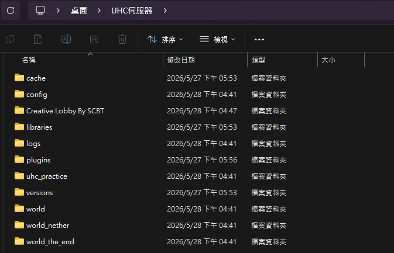
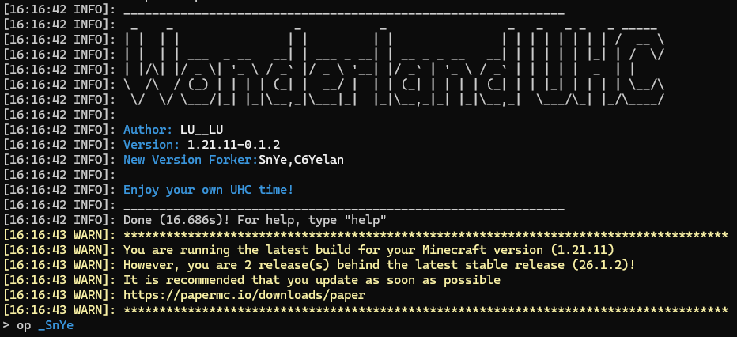
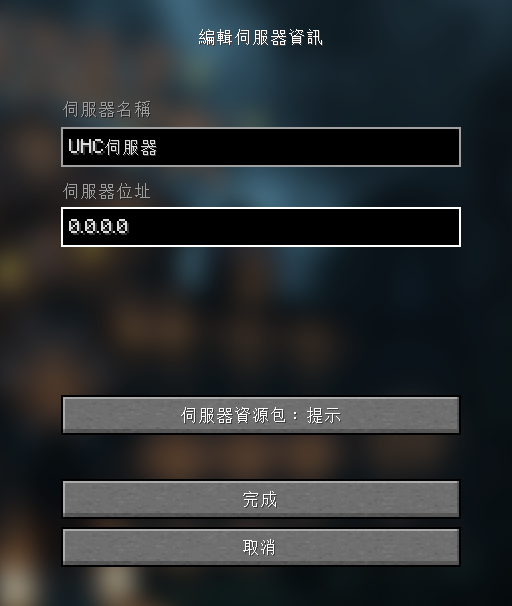
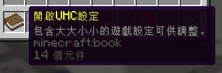
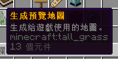
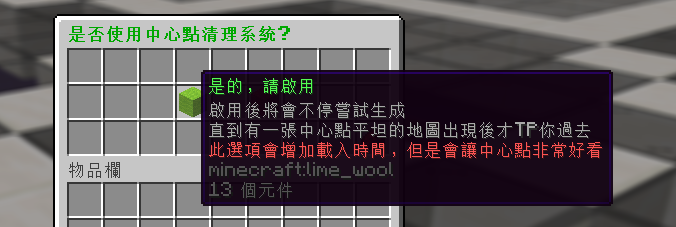
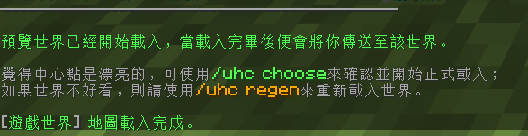
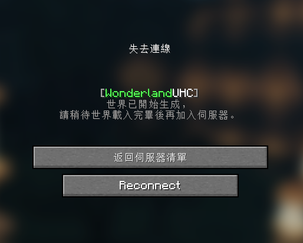
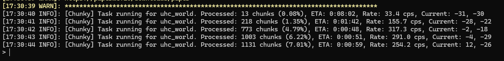
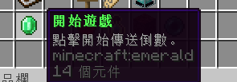

# WonderlandUHC 主持教學
將插件安裝至伺服器後，就可以正式主持UHC了！

## 事前準備

本步驟需要您擁有一個已安裝WonderlandUHC插件的伺服器，若你還沒有建立，請參考上一部[插件安裝教學](插件安裝教學.md)。

## 零、尋找大廳地圖(可選，若不需自訂大廳可跳過)
若您玩過公開的Minecraft伺服器，應該能觀察到大部分的伺服器都有屬於自己的大廳，裡面提供玩家了解伺服器資訊或放置NPC商店等，WonderlandUHC也允許使用者建立自己的大廳！
我們推薦您在開服前尋找一個合適的大廳地圖，讓玩家能在一個美麗的建築裡等待比賽開始，當然，您也可以讓插件自行生成一個原版世界作為大廳。

1. 您可以透過[Planetminecraft](https://www.planetminecraft.com/projects/tag/lobby/)等地圖網站，或上網搜尋`Minecraft伺服器大廳下載`、`Minecraft Server lobby download`等關鍵字，下載自己喜歡的大廳地圖

	**備註：請務必檢查地圖介紹裡是否標註「大廳座標」，否則進入遊戲後可能會發生找不到大廳建築的尷尬情況！**

	※本篇教學提供一個範例大廳地圖-Creative Lobby By SCBT [點我下載](https://drive.google.com/drive/folders/1dUEs6czcphgi1m61nel-tzvnBp788EDa?usp=drive_link)(此地圖已找不到原下載連結)
	此大廳建築座標位於`557,10,-1321`

2. 請確認您的大廳地圖是否為壓縮檔，若有請自行解壓縮，隨後將大廳地圖放入伺服器資料夾內
	

3. 由於前幾篇教學為了測試伺服器是否能正常開啟，伺服器核心已在資料夾內新增一個原版世界`world`，若要將他取代，有兩個方式
	(此步驟使用圖片較難解釋，為避免混淆，不放上示範截圖)
	- 打開大廳世界資料夾，將所有內容複製並取代原來的`world`
	- 刪掉伺服器預設的world，將下載來的大廳世界資料夾重新命名為`world`

## 一、進入伺服器
1. 確認伺服器已開啟後，請在伺服器後台輸入`op (您的Minecraft ID)`給予自己管理員權限(伺服器在跑圖前屬於不公開狀態，只有管理員能進入伺服器進行設定)
	
2. 新增一個伺服器或直接加入伺服器，位址為`0.0.0.0`，這是提供開服者電腦進入的本地IP
	

3. 成功進入伺服器後，若您有自行設定大廳世界，請傳送至大廳建築物，隨後輸入`/setspawn`設定大廳重生點 **否則每當有人進入伺服器，可能會重生在虛空或詭異的地方頻繁死亡！**

## 二、調整UHC設定
成功加入自己建立的UHC伺服器後，就可以開始設定專屬於您的UHC了！**由於設定選項非常多，在此不逐項講解**。

- 若您具備管理員權限，進入伺服器後系統會給予一本設定書，右鍵開啟可調整準備舉辦的比賽設定 ，另外也有其他道具可查看當前的設定狀況
	

## 三、選擇、預載入UHC比賽世界
遊戲設定完畢後，接著得決定UHC比賽世界，大廳世界可不能拿來打UHC。

1. 點擊生成世界選項，並決定是否啟用中心點篩選功能
	- **我們強烈建議開啟此選項，關閉選項可能使系統生出非常多水域的地圖和中心點，這樣會使遊玩體驗非常糟糕！**

	
	

2. UHC世界生成完畢後，系統會提示您是否滿意，若您確定將目前的世界作為比賽世界，請輸入`/uhc choose`，否則請重新生成地圖
	

3. `/uhc choose`指令會發送系統「開始跑圖」的請求，此時所有人會被踢出伺服器，若嘗試進入，系統會提醒「正在跑圖」，此時伺服器也會在後台輸出跑圖進度，等待載入完畢即可重新進入伺服器
	
	

4. 跑圖完畢後，原本跑圖的選項會轉變為「開始遊戲」，邀請玩家進入伺服器後即可開始！
	

## 恭喜您已經學會主持一場UHC，現在就開始邀請朋友遊玩吧！
若您具備網路相關知識，可能已經自行設定好網路環境，讓玩家可以直接連到您開啟的伺服器了

若您對此不熟悉，我們也提供了簡易的連線方式
### 接下來請前往[伺服器連線教學](番外1-伺服器連線教學.md)，了解如何透過外部程式，邀請朋友進入您的UHC伺服器
### 也可以前往[Discord機器人公告教學](Discord機器人公告教學.md)或[防X-ray設定教學](番外2-防X-ray設定教學.md)，參考插件其他相關功能。