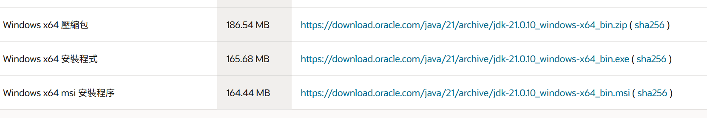
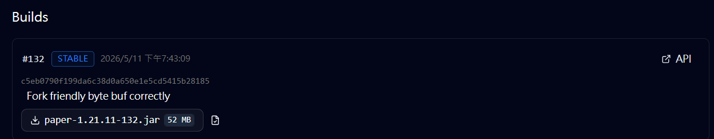
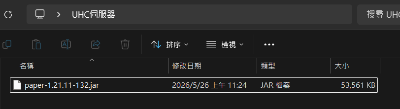
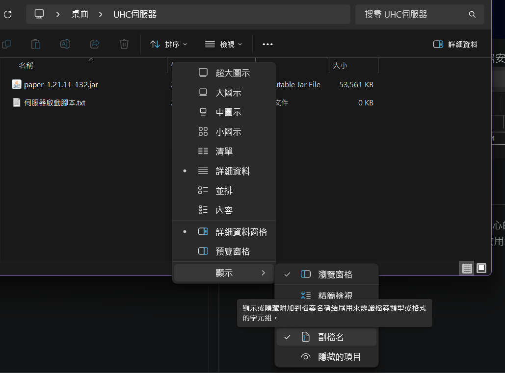
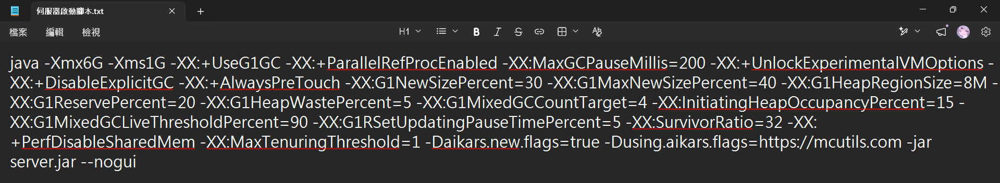
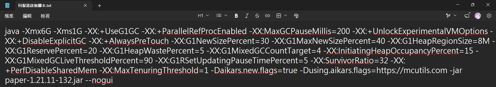
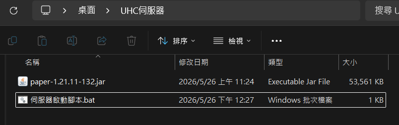
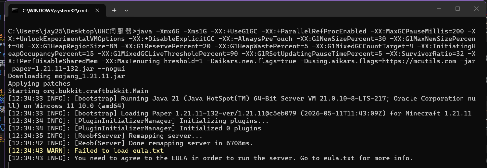
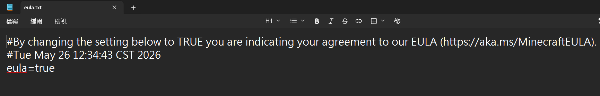
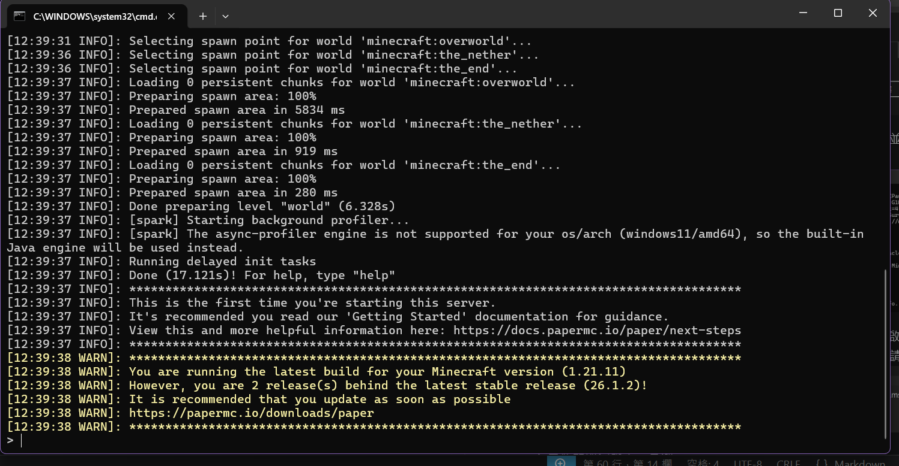

# WonderlandUHC 伺服器架設教學

本教學將帶領您從零開始，順利建立搭建一個屬於自己的UHC伺服器！

## 事前準備

1. 請確認自己擁有1台10年內出廠，具有至少8G記憶體的「桌上型電腦」，或5年內出廠，與上述同規格的「筆記型電腦」，記憶體的容量會很大程度影響電腦和伺服器的順暢度！
    (本教學皆以Windows系統演示，其他系統的狀況可能有非常大的差異，需要自行查詢相關教學)

2. 請確認自己身處具有穩定網路的環境，例如房間內，並且網路來源需為**家用網路(數據機)；若您透過行動網路開啟伺服器，可能會導致您的流量瞬間耗光！**

3. 請確認自己擁有一個正版Minecraft可以自行測試，測試版本為1.21.11

## 一、準備Java環境

Minecraft伺服器的本質是JAVA虛擬機，在1.21.11版本中，我們需要安裝Java 21到系統內，請依照下列指示操作

1. 前往Oracle官方網站下載Java 21[(點我開啟連結)](https://www.oracle.com/java/technologies/javase/jdk21-archive-downloads.html)

2. 尋找Windows下載連結，任意的連結皆可下載同一份Java 21

    

3. 依照指示完成安裝(若您沒有特別需求，可持續點擊「下一步/Next」安裝)

## 二、安裝插件伺服器核心-Paper

架設伺服器需要服主電腦擁有伺服器核心。Minecraft官方的伺服器核心只能提供純原版設定，無法安裝插件。

因此我們選擇Paper作為開發與安裝插件的環境，Paper是Minecraft社群上非常受歡迎的第三方核心，具備高效能特色，且自帶防x-ray功能，非常適合用於開UHC伺服器。

1. 建立一個空資料夾，可隨意取名，作為伺服器的安裝位置

    

1. 前往Paper官方網站下載1.21.11版本的伺服器核心，下載按鈕可能需要稍微下滑，看見後優先下載最新的Build檔案[(點我開啟連結)](https://fill-ui.papermc.io/projects/paper/version/1.21.11)

    

2. 將伺服器核心放入剛剛建立的空資料夾(伺服器安裝位置)

    

## 三、設定伺服器腳本，開啟伺服器

安裝Java環境和伺服器核心後，需要一個能夠控制核心的腳本，您可以將此當作是伺服器核心的遙控器，做完這次段落，就能完整啟用您的伺服器了~

1. 在伺服器資料夾內，新增一個空文字文件，名字隨意，並開啟副檔名顯示(檢視->顯示附檔名)

    

2. 複製下列腳本範例至文字文件內

    ```txt
    java -Xmx6G -Xms1G -XX:+UseG1GC -XX:+ParallelRefProcEnabled -XX:MaxGCPauseMillis=200 -XX:+UnlockExperimentalVMOptions -XX:+DisableExplicitGC -XX:+AlwaysPreTouch -XX:G1NewSizePercent=30 -XX:G1MaxNewSizePercent=40 -XX:G1HeapRegionSize=8M -XX:G1ReservePercent=20 -XX:G1HeapWastePercent=5 -XX:G1MixedGCCountTarget=4 -XX:InitiatingHeapOccupancyPercent=15 -XX:G1MixedGCLiveThresholdPercent=90 -XX:G1RSetUpdatingPauseTimePercent=5 -XX:SurvivorRatio=32 -XX:+PerfDisableSharedMem -XX:MaxTenuringThreshold=1 -Daikars.new.flags=true -Dusing.aikars.flags=https://mcutils.com -jar server.jar --nogui
    ```

    

3. 修改`server.jar`部分，改成「您下載的伺服器核心」名稱

    **※例如前面步驟的核心名稱為`paper-1.21.11-132.jar`，就要將腳本的`server.jar`換成`paper-1.21.11-132.jar`，兩側的名稱務必保一致，否則伺服器無法正常開啟！**

    

4. 將編輯好的文檔更名為`伺服器啟動腳本.bat`，主檔名例如`伺服器啟動腳本`可以任意更改，**`.bat`是Windows系統負責辨識腳本的副檔名，不可隨意更改！**

    

5. 左鍵點擊兩次腳本，開啟伺服器，直到出現"EULA"相關字詞，並且不再輸出日誌

    

6. 直接關閉伺服器視窗，這時伺服器資料夾會出現多個檔案，開啟`eula.txt`，並將內容`eula=false`改成`eula=true`，修改後請記得存檔

    

7. 重新開啟伺服器，直到出現`Done (17.121s)! For help, type "help"`，代表伺服器已成功建立

    

<!-- markdownlint-disable-next-line MD026 -->
## 伺服器架設成功！

恭喜你已經完成最複雜的架設步驟，成功建立一個能安裝插件的伺服器了，不過伺服器內還未安裝WonderlandUHC插件，無法用來主持UHC比賽

### 接下來請前往[插件安裝教學](插件安裝教學.md)，了解如何啟用插件
