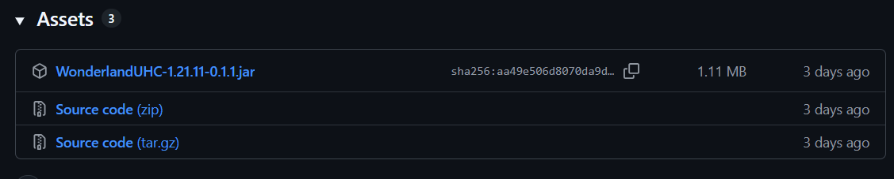
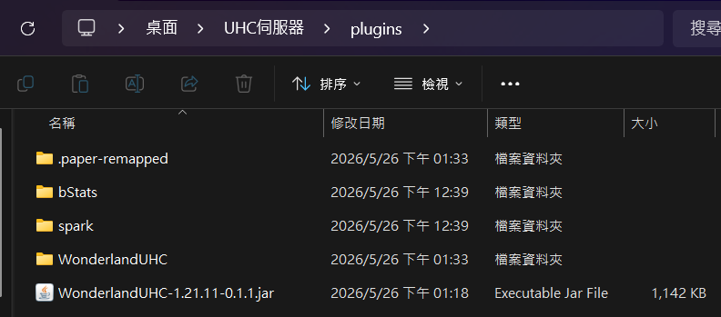
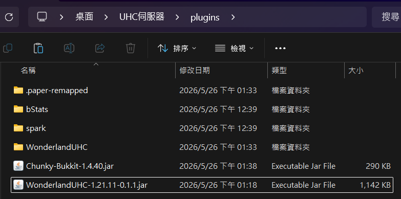
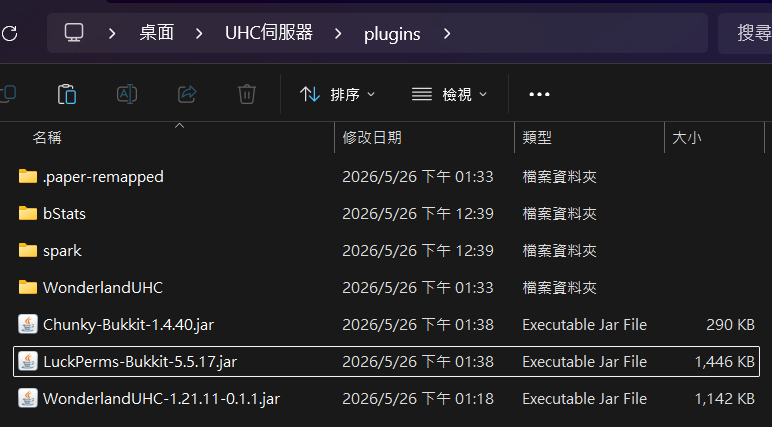
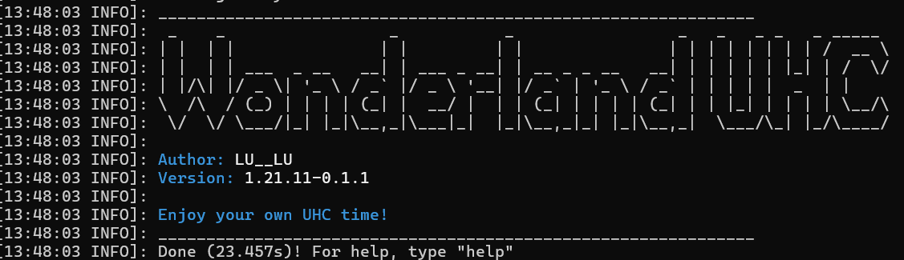

# WonderlandUHC 插件安裝教學

成功架設伺服器後，就可以開始安裝UHC插件了，後續的教學都會比前面輕鬆非常多，祝福所有看完教學的使用者都能建立起屬於自己的UHC伺服器！

## 事前準備

本步驟需要您擁有一個1.21.11的paper伺服器，若你還沒有建立，請參考上一部[伺服器架設教學](伺服器架設教學.md)

## 一、安裝Wonderland UHC插件

當您建立並開啟伺服器後，資料夾內會出現多個子資料夾，這份教學將會聚焦操作`(你的伺服器位置)/plugins`資料夾

1. 請至[Release](https://github.com/C6Yelan/Update-WonderlandUHC/releases/)頁面下載最新版WonderlandUHC插件，請注意要下載的是jar檔
    
2. 將插件jar檔放入`(你的伺服器位置)/plugins`資料夾
    (若您目前開著伺服器，請先關閉，伺服器在開啟情況下，伺服器無法讀取新加入的插件)
    

<!-- markdownlint-disable-next-line MD026 -->
### ※完成以上步驟後請不要急著開啟伺服器，WonderlandUHC會因無依賴插件停用！

## 二、安裝依賴插件

WonderlandUHC是一個非常龐大的UHC系統，無法透過一個插件本體達成所有功能，部分功能需要安裝外部依賴插件，才可以完整使用。

1. 安裝Chunky跑圖插件[(點我前往下載頁面)](https://modrinth.com/plugin/chunky/changelog?c=release&g=1.21.11&l=paper)，並放入`(你的伺服器位置)/plugins`
    
2. 安裝LuckPerms權限插件[(點我前往下載頁面)](https://modrinth.com/plugin/luckperms/changelog?g=1.21.11&l=paper)，並放入`(你的伺服器位置)/plugins`
    
3. 開啟伺服器，若安裝成功，會出現插件的歡迎畫面
    

<!-- markdownlint-disable-next-line MD026 -->
## 恭喜成功啟用插件！

現在伺服器和插件都準備好了，接下來就能進入自己的伺服器，準備好主持您的第一場UHC！

### 接下來請前往[UHC主持教學](UHC主持教學.md)，了解如何使用WonderlandUHC插件功能
