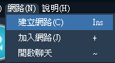
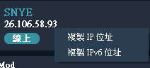

# WonderlandUHC 番外教學1-Radmin簡易連線教學
UHC是一種大型多人競技玩法，需要大量玩家共同參加，此時連線狀況會成為一項議題，設定網路環境也是很複雜的工作，不過好在廣大的網路能提供我們非常方便的工具-Radmin VPN，讓您即使沒有相關知識，也能讓各地玩家連線至您的UHC伺服器！

## 事前準備/觀前提醒
1. 本教學使用Radmin VPN作為連線工具主要提供20~30位玩家的**小型「私人&半公開」UHC伺服器**開服，並不適用於大型公開伺服器，**若您作為公開伺服器管理員，我們認為您應該尋找直連的連線方式並做好資安管理，完全不建議透過此方式讓玩家連線！**

2. 此教學需要您身處在一個穩定的網路環境(例如房間裡)，不適合在外透過此方式開啟伺服器！

3. 本教學需要您擁有一個已安裝WonderlandUHC插件，並預載入完成的伺服器，若您還沒有做好準備，請參考上一部[WonderlandUHC主持教學](UHC主持教學.md)。

## 設定步驟
Radmin VPN主要功能是讓使用者加入、創建虛擬局域網房間，各地玩家待在同一個虛擬房間，彼此的網路就能藉此互相聯繫。
不嚴謹的白話文解釋：你與學校同學雖然身處不同家鄉，不過以「學校」作為媒介，你們在上課時處於同一個班級，此時就能面對面溝通，而私底下依然需要透過社群軟體做為媒介才能溝通。

1. 前往[radmin VPN官網](https://www.radmin-vpn.com/tw/)下載程式

2. 開啟radmin程式，創建虛擬局域網房間(此步驟不強制開服者執行，任何人都可以建立)

	

3. 邀請玩家進入房間，並複製開服者的虛擬IP(不要複製成"IPv6")
**請放心，此軟體不會暴露玩家各自的真實IP，所有玩家之間的聯繫只限於用虛擬IP溝通！**

	

4. 玩家可透過開服者的虛擬IP進入伺服器

## 恭喜您順利舉辦屬於自己的UHC比賽！
若仍然有疑慮 請私訊插件fork開發者，我很樂意協助您解決問題！下圖是fork開發者之一的Discord聯絡資訊

