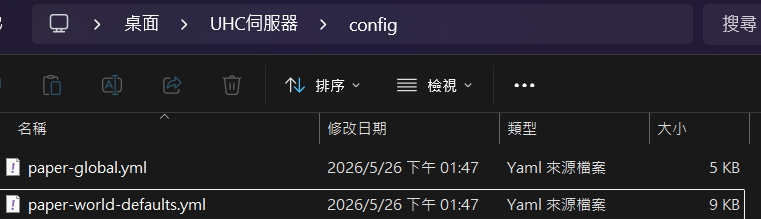
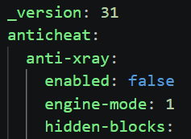
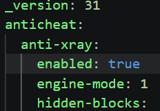
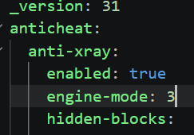
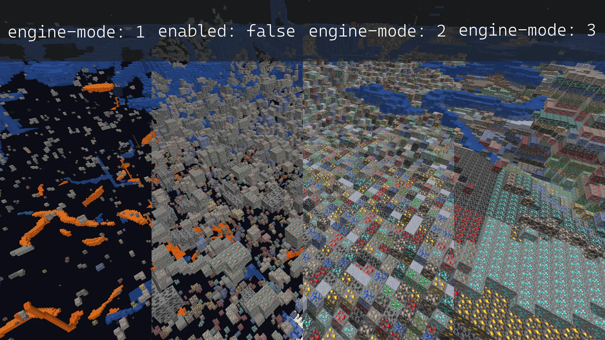
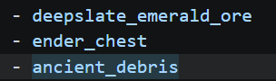

# WonderlandUHC 番外教學2-防透視設定

Minecraft是一款非常自由的沙盒遊戲，在特定環境裡，透視、Freelook(靈魂出竅)等功能可以使採集資源更有效率，不過**UHC是一個講求公平性的遊戲模式，若部分玩家開啟透視或freelook功能，會對一般玩家非常不公平，因此有必要預防此狀況。**

Paper伺服器核心內建提供一套優秀的防透視系統，可抵擋**大多數**具有透視功能的模組、材質包。

<!-- markdownlint-disable-next-line MD026 -->
## 若你對原文文檔感興趣，可[點此](https://docs.papermc.io/paper/anti-xray/)前往研究，本教學只提供基礎設定，不會過於深入調整。

## 事前準備

本步驟需要您擁有一個1.21.11的paper伺服器，若您還沒有建立，請參考[伺服器架設教學](伺服器架設教學.md)

## 設定步驟

0. 若您目前開著伺服器，請先關閉，**不建議在伺服器已開啟狀態下變更防透視系統**
1. 開啟伺服器資料夾，尋找`(你的伺服器位置)/config/paper-world-defaults.yml`
    
2. 開啟檔案，尋找`anti-xray`段落
    
3. 修改功能開關選項，將`false`(關閉)改成`true`(開啟)
    
4. 修改`engine-mode`防透視模式，請依自己喜好設定(第二張圖為官方展示畫面)
    
    
5. 修改底下`hidden-blocks`添加防透視方塊，例如加入遠古遺骸，請添加`ancient_debris`，記得保存文件
    

## 修改成功，開啟伺服器

若您設定無誤，開啟伺服器並進入遊戲後，使用透視材質包測試，就能看到礦物已經被防透視系統覆蓋，代表設定完成！
